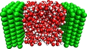

<html>
<body>
<h1> Molsim - Molecular dynamics with GNU Octave </h1>

<figure>
  
</figure> 

molsim supports simulations of

<ul>
<li>simple Lennard-Jones systems,</li>
<li>molecular systems with bond, angle, and torsion potentials,</li>
<li>confined flow systems, eg., Couette and Poiseuille flows,</li>
<li>charged systems using shifted force and Wolf methods,</li>
<li>dissipative particle dynamics systems,</li>
<li>different ensembles,</li>
<li> and more . .</li>
</ul>

<h2>Installation </h2>

At the Octave prompt simply use the command 

 

<pre>
  >> pkg install "https://github.com/jesperschmidthansen/molsim/archive/refs/tags/v&lt;version&gt;.tar.gz"
</pre>

where &lt;version&gt; is the version number.

<h2>An example</h2>
An example of an NVE water simulation script

  <pre>
    
    nloops = 100000; temp0 = 298.15/78.2;
    cutoff= 2.5; cutoff_sf = 2.9;
    lbond = 0.316; kspring = 68421; 
    angle = 1.97; kangle = 490;
  
    molsim('set', 'cutoff', cutoff_sf);
    molsim('set', 'timestep', 0.0005);
    molsim('set', 'exclusion', 'molecule'); 
  
    molsim('set', 'omp', 4);
         
    molsim('load', 'xyz', 'water.xyz');  molsim('load', 'top', 'water.top');
  
    for n=1:nloops 
      molsim('reset')
      
      molsim('calcforce', 'lj', 'OO', cutoff, 1.0, 1.0, 1.0);
      molsim('calcforce', 'coulomb', 'sf', cutoff_sf);
      molsim('calcforce', 'bond', 0, lbond, kspring);
      molsim('calcforce', 'angle', 0, angle, kangle);
      
      molsim('integrate', 'leapfrog');
    endfor
    
    molsim('clear');
</pre>

<h2>Contribution</h2>

I encourage anyone who uses or plan to use molsim to submit problematic issues - this includes issues regarding the documentation. I also welcome contributions to the code for the project, whether it is core features (seplib), post simulation data analysis programs, or extending the molsim wrapper. 

</body>
</html>
