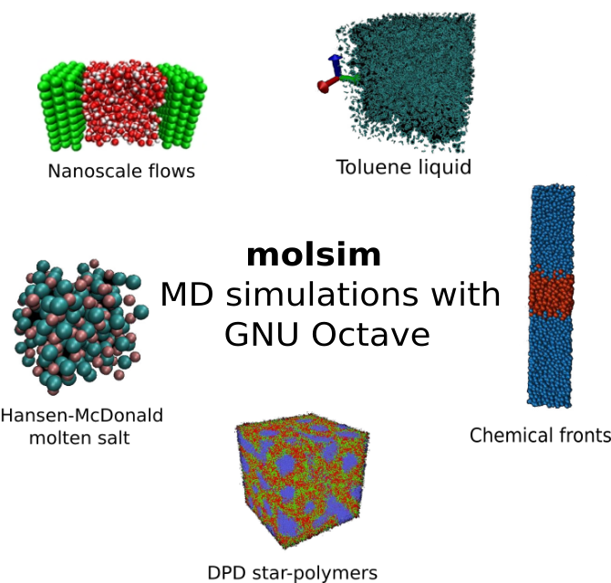

 <html>
<style>
table, th, td {
  border:1px solid black;
}
</style>
<body>
<h1> molsim - Molecular dynamics with GNU Octave </h1>
<p>
 <table>
  <tr>
    <td>
    <figure>
  I     
    </figure>
    </td>
    <td>
    <h2>
    molsim supports simulations of
    </h2>
    <ul>
    <li>simple Lennard-Jones systems,</li>
    <li>molecular systems with bond, angle, and torsion potentials,</li>
    <li>confined flow systems, eg., Couette and Poiseuille flows,</li>
    <li>charged systems using shifted force,</li>
    <li> and more ...</li>
    </ul>
  </td>
</tr> 
</p>

<h2>Installation </h2>
<p>At the Octave prompt simply use the command </p>
<pre>
 <code>
  >> pkg install "https://github.com/jesperschmidthansen/molsim/archive/refs/tags/v&lt;version&gt;.tar.gz"
 </code> 
</pre>
<p>where &lt;version&gt; is the version number. 

<h2>An example</h2>
An example of an NVE water simulation script

```octave
nloops = 1e4; dt = 5e-4;
temp0 = 3.0;dens0 = 3.16; temp0 = 298.15/78.2; 

cutoff = 2.9;

lbond = 0.316; kspring = 68421; 
angle = 1.97; kangle = 490;

molconfgen("water.xyz", "water.top", 2000, 0.1);

sim = molsim();
sim.setconf("conf.xyz");

sim.pairforce.max_cutoff = cutoff;
sim.integrator.dt = dt;
sim.thermostat.temperature = temp0;

sim.setbonds("bonds.top");
nbonds = sim.bonds.nbonds;
sim.bonds.springs = kspring*ones(nbonds,1); sim.bonds.l0 = lbond*ones(nbonds,1); 

sim.setangles("angles.top");
nangles = sim.angles.nangles;	
sim.angles.springs = kangle*ones(nangles,1); sim.angles.a0 = angle*ones(nangles, 1);

sim.atoms.setexclusions(sim.angles.pidx, "angles");


for n=1:nloops
	sim.pairforce.lj(sim.atoms, "OO", [2.5, 1.0, 1.0, 1.0]);   
	sim.pairforce.sf(sim.atoms, cutoff);
	sim.bonds.harmonic(sim.atoms, 0);
	sim.angles.harmonic(sim.atoms, 0);

	sim.thermostat.nosehoover(sim.atoms);
	sim.integrator.step(sim.atoms, sim.pairforce);
	
	if rem(n, 10)==0
		sim.scalebox(dens0);
	end

end

sim.atoms.save("final.xyz");

```
<p> <b>IMPORTANT NOTE</b>: The 'water.xyz' configuration file and 'water.top' topology file must be in
same directory from where you execute the script. They can be found under the project's resource/ folder </p>

<h2>Contribution</h2>
<p>
I encourage anyone who uses or plans to use molsim to submit problematic issues - this includes issues regarding the documentation. I also welcome contributions to the code for the project, whether it is core features or post simulation data analysis programs. 
</p>


<h2>To-do</h2>
Octave now supports object oriented programming. molsim is under complete reconstructed to benefit
from this. Matlab compatibility is not a priority.

- [X] Feature: Bond potential
- [X] Feature: Angle potential
- [X] Feature: Dihedral potential
- [X] Feature: Pair interaction exclusion list 
- [X] Feature: Simple cubic setup method in atoms class
- [ ] Feature: Barostate
- [ ] Feature: Standard run time sample classes
- [X] Feature: Electrostatic interactions (shifted force)
- [ ] Feature: A set of molecular and atomic configurations 
- [ ] Feature: Molecular class for infrastructure
- [X] Feature: Nose-Hoover thermostat
- [X] Feature: Easy complex system setup tool
- [ ] Feature: DPD support (initiated)
- [X] Revision: endX -> end
- [X] Revision: Some miscellaneous functions/definitions for mex-files 
- [ ] Revision: Class properties access. Should these be different from public?
- [ ] Revision: Define class constants with correct properties (Constant=true)
- [ ] Revision: All classes should have a disp method
- [ ] Revision: Consider whether methods should have specified properties
- [ ] Revision: Naming convensions (at the moment none)  
- [X] Test/examples: Example folder with different scripts


</body>
</html>
